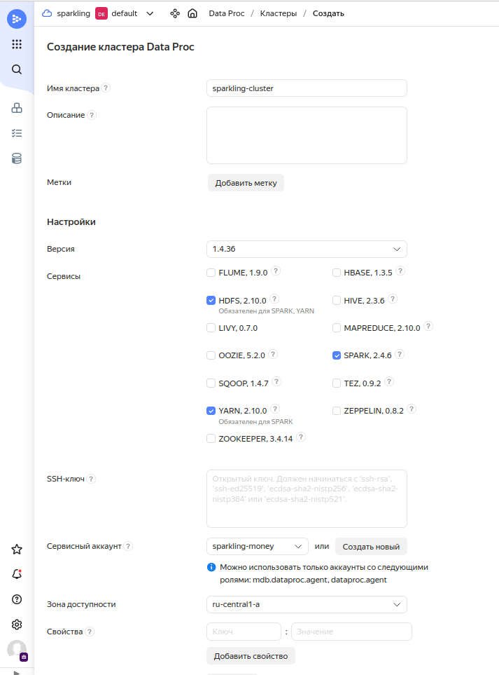
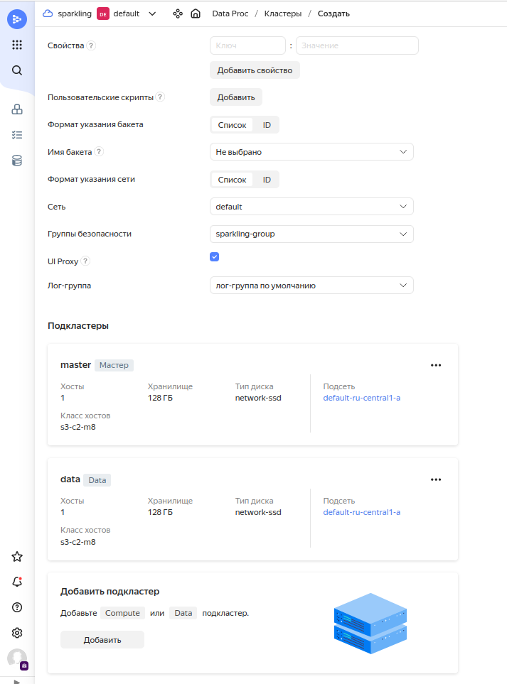
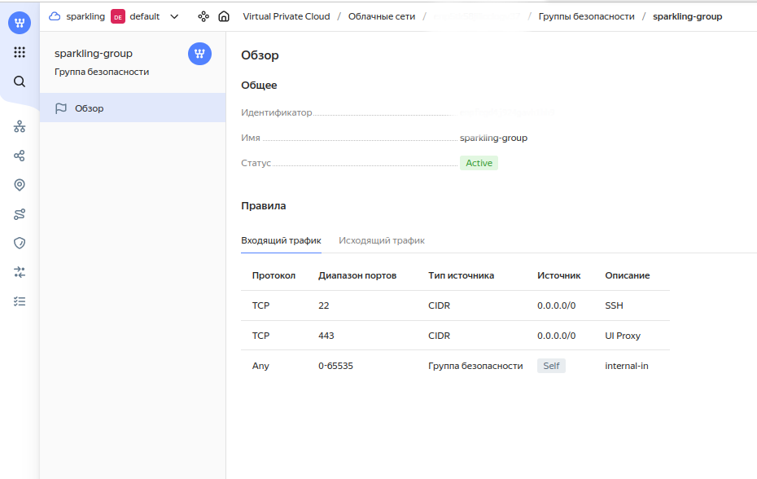
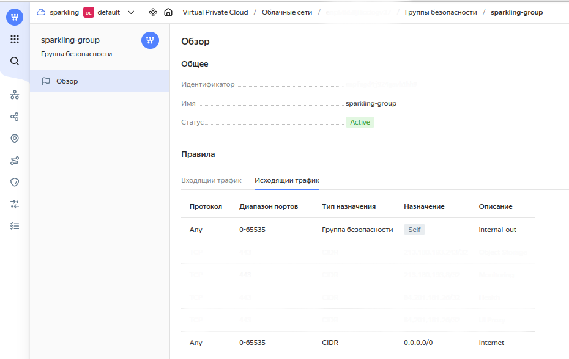

## Deployment in local mode

By local mode we mean launching Spark application on **local[K]** or **local-cluster[N,C,M]** 
[master](https://spark.apache.org/docs/latest/submitting-applications.html#master-urls).

Local mode allows you to launch application on your personal machine without configuring complex machine cluster.

### Minimal requirements

* Ubuntu 16.04, 20.04, 22.04;
* 2 CPU cores, 12 GB RAM;
* [Official JDK 8](https://www.oracle.com/cis/java/technologies/downloads/) or *sudo apt install openjdk-8-jdk*;
* [Conda](https://docs.conda.io/en/latest/) ([Miniconda](https://docs.conda.io/projects/miniconda/en/latest/) will be enough);
* Pyspark 2.4.6 (will be installed via conda).

### Installation

```bash
git clone https://gitlab.com/rainifmo/sparkling.git
cd sparkling

# Prepare conda environment
conda create -y --name sparkling-env python=3.7
conda activate sparkling-env
pip install -r requirements/pytorch.txt
```

### Launch via python interpreter from conda environment

Make sure terminal is opened in the root of Sparkling project and 
correct conda environment (**sparkling-env** from previous step) is activated.

Make sure to supply **PYTHONPATH** with absolute path of project's root (the 
next examples assumes it is */home/user/sparkling*)

```bash
# Simple script to demonstrate project's functionality

# This is for python to correctly resolve paths
PYTHONPATH=/home/user/sparkling python examples/local/tabular.py

# You can view full history of invoked algorithms
cat examples/logs/abalone-local.json

# Example of processing multimodal dataframe with text modality
PYTHONPATH=/home/user/sparkling python examples/local/text.py
cat examples/logs/popular-quotes-local.json

# Example of processing images dataframe
PYTHONPATH=/home/user/sparkling examples/local/image.py
cat examples/logs/sports-celebrity-local.json
```

*You can find other scripts for local mode in [examples/local](../examples/local).*

## Deployment on YARN

*Sparkling* also supports **yarn** master. This means Spark application are managed by
[YARN](https://hadoop.apache.org/docs/current/hadoop-yarn/hadoop-yarn-site/YARN.html)
and data is stored in [Hadoop File System](https://hadoop.apache.org/).

We carried out experiments on [Yandex Cloud's Data Proc](https://cloud.yandex.ru/services/data-proc) cluster to verify 
*Sparkling* functionality in distributed environment (e.g., computations on multiple machines) on huge amount of data.

You can power your Apache Spark infrastructure by other resource providers, 
but *Sparkling* installation and functionality were tested only on Yandex Cloud.

### Minimal requirements

* Ubuntu 16.04, 20.04, 22.04;
* 2 nodes in cluster, 2 vCPU and 8 GB RAM each;
* [Conda](https://docs.conda.io/en/latest/);
* Pyspark 2.4.6 (will be installed via conda).

Here is a configuration of Data Proc cluster that satisfies minimal requirements:

 


You also need to configure [security groups](https://cloud.yandex.com/en/docs/vpc/concepts/security-groups):




### Installation

First of all, you need to follow [installation](#installation) steps on cluster's master mode.
After dependencies are installed, you need to pack conda environment into single archive via 
[conda pack](https://conda.github.io/conda-pack/):

```bash
conda install -y conda-pack
conda pack -o sparkling-env.tar.gz
```

### Launch via spark-submit

Note, that all datasets should be located in Hadoop File System (not on the cluster node's local file system).

All next steps should be executed on cluster's master node from *Sparkling*'s root.

Set **PYSPARK_DRIVER_PYTHON** env variable to point to python interpreter, provided by conda environment
(*/opt/conda/envs/sparkling-env/bin/python* in our case, but it can be different for your master node).

Set **PYSPARK_PYTHON** to *./environment/bin/python* (make Spark executors to use interpreter from conda environment).

Make sure, that *spark-env.sh* does not override **PYSPARK_DRIVER_PYTHON** and **PYSPARK_PYTHON** variables.

Archive framework's [python module](/sparkling) (```zip -r sparkling.zip sparkling```).

Then you are ready to submit application to yarn:

```bash
/usr/bin/spark-submit \
--archives spark-env.tar.gz#environment \  
--py-files sparkling.zip \
--master yarn \
--jars bin/heaven.jar \
<your-script.py> <args...>
```

See [unimodal.sh](../examples/cloud/unimodal.sh) for an example of submitting tabular datasets.
To reproduce it on your environment, copy datasets from repository to hdfs's */user/unimodal*:

```bash
hdfs dfs -put heaven/src/test/data /user/unimodal
```

Possible command to run script (dataset abalone.csv for 150 seconds):

```bash
examples/cloud/unimodal.sh abalone 150
```

### Prerequisites for application with image modalities

*Sparkling* makes each cluster's node read image batch from *hdfs*,
that's why each worker should have read access to *hdfs*.

At first, each worker need to contain 
[libhdfs.so](https://hadoop.apache.org/docs/stable/hadoop-project-dist/hadoop-hdfs/LibHdfs.html).

Make sure, that your hadoop installation also includes this artifact, otherwise, install it manually.

If you face problems with *libhdfs* installation, you can try to apt install 
this [.deb package](../bin/libhdfs0_2.10.0-1_amd64.deb).
That is the distribution we used in our test environment.

The second requirement is *locate* package, which can be easily installed:

```bash
apt install locate
updatedb
```

Its purpose is to easily determine *libhdfs.so* location. We hope to avoid using this util one day.

### Submit application with image/text modalities

To efficiently process image/text data, **sparkling** exploits 
[pyarrow](https://arrow.apache.org/docs/python/index.html) module.

To enable it in spark application, you should provide specific configs:

```
spark.sql.execution.arrow.enabled=true
spark.executorEnv.ARROW_PRE_0_15_IPC_FORMAT=1
```

See [multimodal.sh](../examples/cloud/multimodal.sh) for multimodal dataframe's submission. Note, that datasets are not 
present in this repository, and you should manually put them in hadoop's */user/multimodal*

Possible command to run script ([diffusion](../examples/cloud/diffusion.py) dataset, *softmax* strategy,
*optuna* [hpo backend](GLOSSARY.md#hpo-backend), *silhouette_approx* as [target measure](GLOSSARY.md#target-measure), 
1500 seconds for [optimisation pipeline](GLOSSARY.md#optimisation-pipeline)):

```bash
examples/cloud/multimodal.sh diffusion softmax optuna silhouette_approx 1500
```
