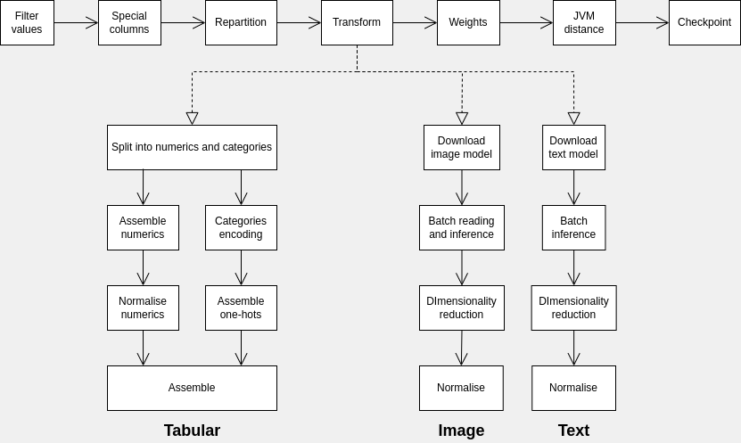
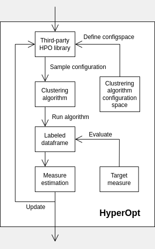
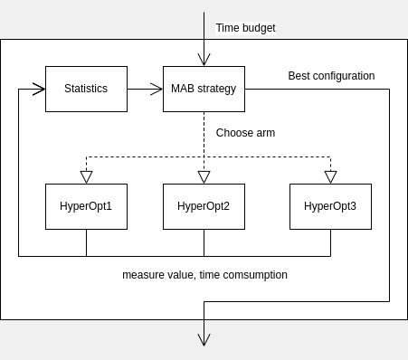

## How does it work

### [Preprocessing pipeline](GLOSSARY.md#preprocessing-pipeline)

*Sparkling* introduces its own dataframe preprocessor, which transforms 
raw dataframe into suitable for further clustering multimodal dataframe. 

Here is the top-level blueprint:



In fact, pipeline processor is a monad with the following stages:
* **Filter values** removes all nullable rows from dataframe
* **Special columns** handles id and external label columns
* **Repartition** invokes dataframe's repartition with desired number of partitions
* **Transform** computes vectorised representation of each modality
* **Weights** calculates each modality's weight
* **JVM distance** handles creation of multimodal distance on jvm side
* **Checkpoint** caches preprocessed dataframe and truncate execution plan

Note, that framework implements special transformer for each modality type.

### [Optimisation pipeline](GLOSSARY.md#optimisation-pipeline)

When you obtain **[SparklingDF](../sparkling/data/dataframe.py)**, 
you can search for the best clustering algorithm and its hyperparameters.

The framework introduces novel method to look for optimal dataframe 
partition w.r.t. [target measure](GLOSSARY.md#target-measure).

Basic block of the [optimisation pipeline](GLOSSARY.md#optimisation-pipeline) 
is [HyperOpt](../sparkling/opt/hyperopts.py).

It handles [HPO backend](GLOSSARY.md#hpo-backend) and holds optimisation
state for a single clustering algorithm ant it's configuration space:



Multiple such blocks are managed by [multi-armed bandit](https://en.wikipedia.org/wiki/Multi-armed_bandit)
solver, which distributes time budget between "arms" depending on time consumption and rewards:




## Development

### How to modify 'heaven' subproject

This subproject is written on Scala 2.11.12 and is built by [sbt](https://www.scala-sbt.org/).

After changes are made, you need to build jar with the following command:

```bash
# From /heaven, where build.sbt is located
sbt package
```

Make sure to put compiled jar into [/bin/heaven.jar](/bin/heaven.jar).

### How to implement new measure function

* Open *heaven*'s [Internals](../heaven/src/main/scala/ru/ifmo/rain/measures/Internals.scala)
* Write your own function;
* Jump to **evaluate()** method in this file and add unique string identifier to the pattern matching;
* [Recompile jar](#how-to-modify-heaven-subproject);
* Open *sparkling*'s [measures.py](../sparkling/opt/measures.py), add new enum member, first field should be 
unique identifier from previous steps, the second flag should be *true* if function is decreasing.

### How to implement new multi-armed bandit strategy

* Open *sparkling*'s [mabs.py](../sparkling/opt/mabs.py);
* Create new descendant from **BaseMabSolver** and implement method **draw()**.;
* Do not forget to add new member to enum **MabSolver** in the bottom.

### How to integrate another third-party HPO library

* Open *sparkling*'s [hyperopts.py](../sparkling/opt/hyperopts.py);
* Create new descendant from **BaseHyperOpt** and implement method **step()**;
* Do not forget to add new member to enum **HyperOpt** in the bottom.

